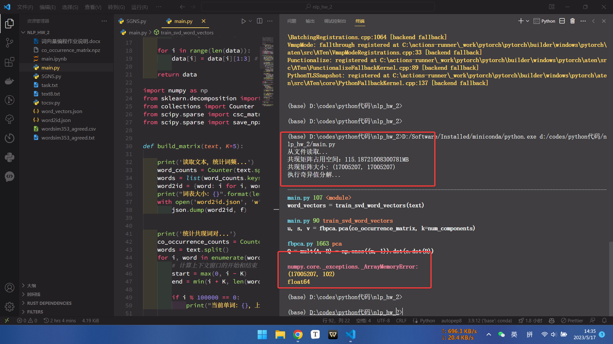
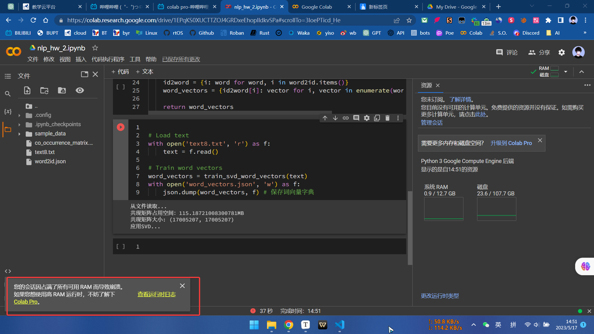
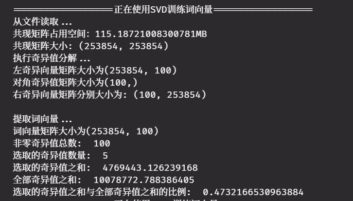
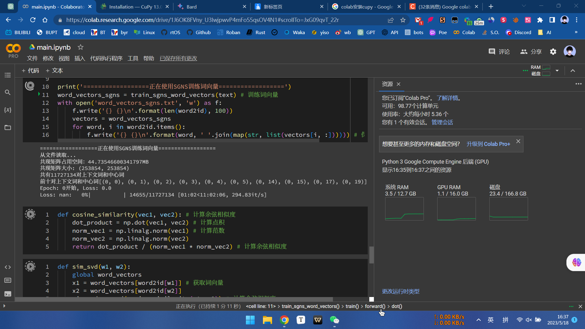

# NLP作业二

**张扬2020212185**

[TOC]

## 一、SVD(Singular value decomposition)

### 1-1 算法细节

奇异值分解（SVD）是一种在自然语言处理领域中常用的线性代数技术，可以用于训练词向量。以下是使用SVD训练词向量的一般步骤：

1. 构建**共现矩阵**：
首先，需要从一个大型文本语料库中构建一个共现矩阵（Co-occurrence Matrix）。共现矩阵是一个表示词汇之间共现频率的矩阵。行表示目标词汇，列表示上下文词汇。通常，我们根据一个滑动窗口（如大小为 5 的窗口）来计算词汇之间的共现频率。
3. 执行**奇异值分解**：
将调整后的共现矩阵进行奇异值分解。SVD 将共现矩阵分解为三个矩阵：U、S 和 V。其中，U 和 V 分别是左奇异向量矩阵和右奇异向量矩阵，S 是对角奇异值矩阵。SVD 的主要目的是找到这些矩阵，使它们的乘积能够尽可能地逼近原始共现矩阵。
4. **降维**：
选择一个合适的截断值 $k$，保留 $U$ 矩阵的前 $k$ 个列向量（左奇异向量）。这样，$U$ 矩阵就被压缩为一个较小的矩阵，每个词汇的行向量表示了其 $k$ 维的词向量。这个压缩过程可以减少词向量的维度，同时保留其在语义空间中的重要信息。
5. **提取词向量**：
最后，从压缩后的 $U$ 矩阵中提取每个词汇的行向量作为其词向量。这些词向量捕捉了词汇之间的语义和语法关系，可以用于各种自然语言处理任务。

需要注意的是，SVD 基于的词向量训练方法计算量较大，因此难以应用于大规模语料库。为了解决这个问题，可以使用其他更高效的词向量训练方法，如 Word2Vec、GloVe 和 FastText。

### 1-2 构建共现矩阵

```py
word2id = {}
def build_matrix(text_, K=5):
```

`build_matrix`函数的主要目的是构建共现矩阵。下面是函数的主要步骤和功能：

1. 统计词频：函数接受一个文本字符串作为输入，使用`Counter`类统计文本中每个词的频率，并得到词频字典`word_counts`。

2. 构建词表：将词频字典中的词提取出来，形成词表`words_sheet`。同时，构建一个词到ID的映射字典`word2id`，其中每个词对应一个唯一的ID

3. 将词到ID的映射字典保存到JSON文件中，文件名为`'word2id.json'`。

   - ```py
         print('读取文本，统计词频...')
         word_counts = Counter(text_.split()) # 统计词频
         words_sheet = list(word_counts.keys()) # 词表
         global word2id
         word2id = {word: i for i, word in enumerate(words_sheet)} # 词到id的映射
         print("词表大小：{}".format(len(words_sheet)))
         with open('word2id.json', 'w') as f:
             json.dump(word2id, f)
     ```

4. 统计共现词对：**遍历文本中的每个单词，对于每个单词，找到其上下文窗口内的其他单词**，并更新共现计数`co_occurrence_counts`。

   - ```py
         print('统计共现词对...')
         words = text_.split()
         print('原文长度：{}'.format(len(words)))
         co_occurrence_counts = Counter()  # 初始化一个空的Counter对象
         for i, word in enumerate(words):  # 遍历文本中的每个单词
             # 计算上下文窗口的开始和结束
             start = max(0, i - K)
             end = min(i + K, len(words))
             if i % 3000000 == 0:
                 print("当前单词：{}，上下文窗口：{}~{}".format(word, start, end))
                 context_words = words[start:end]# 获取上下文单词
             for context_word in context_words: # 遍历每个上下文单词
                 co_occurrence_counts[(word, context_word)] += 1 # 更新共现计数
         print("共现词对数量：{}".format(len(co_occurrence_counts)))
     ```

     

5. 构建共现矩阵：根据共现计数`co_occurrence_counts`和词到ID的映射字典word2id，构建一个共现矩阵`co_occurrence_matrix`。共现矩阵是一个**稀疏矩阵**，其中每个元素表示两个词的共现频次。

6. 将共现矩阵保存为NPZ文件，文件名为`'co_occurrence_matrix_K.npz'`，其中K表示上下文窗口的大小。

7. 返回共现矩阵co_occurrence_matrix和词到ID的映射字典word2id。

   - ```py
         print('构建共现矩阵...')
         row, col, data = [], [], [] # 初始化三个列表
         for (word, context_word), count in co_occurrence_counts.items():       
             if word in word2id and context_word in word2id: # 如果两个词都在词表中
                 row.append(word2id[word]) # 添加行索引
                 col.append(word2id[context_word]) # 添加列索引
                 data.append(count) # 添加共现计数
         co_occurrence_matrix = csc_matrix((data, (row, col)), shape=(len(words_sheet),len(words_sheet))) # 构建共现矩阵
         save_npz('co_occurrence_matrix_{}.npz'.format(K), co_occurrence_matrix)
         print("共现矩阵占用空间：{}MB".format(co_occurrence_matrix.data.nbytes / 1024 / 1024 ))
         print("共现矩阵大小{}".format(co_occurrence_matix.shape))
     ```


总结起来，该函数的功能是读取文本，统计词频，并根据词频构建共现矩阵。共现矩阵用于表示文本中词与词之间的共现关系，可以用于后续的自然语言处理任务。

#### 1-2-bug-fix

一开始共现矩阵的大小有1700万行，直接导致内存溢出。

搞了好久优化后才发现，原来一直在迭代的不是词表而是文本，没有保证**唯一性**。

假设文本中有$N$个**唯一的词汇**。那么共现矩阵的大小将是一个$N×N$的矩阵，其中每个元素表示两个词汇在文本中共同出现的次数。





### 1-3 执行奇异值分解和降维

奇异值分解（Singular Value Decomposition, SVD）是一种在线性代数中常用的方法，用于将一个矩阵分解为三个矩阵的乘积。

如果我们有一个矩阵A，我们可以将其分解为：

`A = U * Σ * V^T`

其中：

- `U`是一个m x m的正交矩阵，其列向量被称为左奇异向量（Left Singular Vectors）。这些向量构成了A的列空间。

- `Σ`是一个m x n的对角矩阵，其对角线上的元素被称为奇异值（Singular Values）。这些值是A的协方差矩阵的特征值的平方根，且按降序排列。

- `V^T`是一个n x n的正交矩阵，其行向量被称为右奇异向量（Right Singular Vectors）。这些向量构成了A的行空间。

在实际应用中，左奇异向量可以看作是数据的"空间"或"维度"，奇异值代表了这些"空间"或"维度"在数据中的重要性，右奇异向量则代表了数据在这些"空间"或"维度"上的表示。

因此，SVD被广泛用于降维、信息检索、以及推荐系统等领域，因为它能够捕获数据中最重要的特征，并且可以用较少的维度来近似表示原始数据。

------

```py
def train_svd_word_vectors(text, K=5, num_components=100):
```

`train_svd_word_vectors`函数的主要目的是训练`svd`词向量模型。下面是函数的主要步骤和功能：

1. 读取共现矩阵：如果`read_from_file`为True，则从文件中读取共现矩阵`co_occurrence_matrix`和词到ID的映射字典`word2id`。共现矩阵文件为`'co_occurrence_matrix_5.npz'`，词到ID的映射文件为`'word2id.json'`。

2. 如果`read_from_file`为False，则调用前一个函数`build_matrix(text, K)`来构建共现矩阵co_occurrence_matrix和词到ID的映射字典word2id。

   - ```py
         # Build co-occurrence matrix
         read_from_file = True
         if read_from_file:
             print('从文件读取...')
             co_occurrence_matrix = load_npz('co_occurrence_matrix_5.npz')
             with open('word2id.json', 'r') as f:
                 word2id = json.load(f) # 从文件读取词到id的映射
             print("共现矩阵占用空间：{}MB".format(co_occurrence_matrix.data.nbytes / 1024 / 1024 ))
             print("共现矩阵大小: {}".format(co_occurrence_matrix.shape))
         else:
             co_occurrence_matrix, word2id = build_matrix(text, K)
     ```

     

3. **执行奇异值分解(SVD)**：对共现矩阵`co_occurrence_matrix`进行奇异值分解，得到左奇异向量矩阵`u`、奇异值矩阵`s`和右奇异向量矩阵`v`。参数`num_components`表示要保留的奇异值数量。

   - ```py
         print('执行奇异值分解...')
         u, s, v = fbpca.pca(co_occurrence_matrix, k=num_components)
         print("左奇异向量矩阵大小为{}\n对角奇异值矩阵大小为{}\n右奇异向量矩阵分别大小为: {}\n".format(u.shape, s.shape, v.shape))
     ```

     

4. 提取词向量：从左奇异向量矩阵u中选择前`num_components`列，实现**降维**，并将其作为词向量矩阵`word_vectors`。

5. 打印输出：打印奇异值分解结果和词向量矩阵的大小。

6. 返回词向量矩阵`word_vectors`。

   - ```py
         print('提取词向量...')
         # 提取左奇异向量矩阵的前k列,实现降维
         u_k = u[:, :num_components]
         # 提取词向量
         word_vectors = u_k
         print("词向量矩阵大小为{}".format(word_vectors.shape))
         
         return word_vectors
     ```


总结起来，该函数的功能是训练词向量模型，其中使用共现矩阵和奇异值分解来生成词向量。词向量是在降维过程中从奇异值分解的结果中提取得到的。这些词向量可以用于表示文本中的词语，并在自然语言处理任务中发挥作用。

奇异值分解的速度比较慢，我采用了以下优化的方法：

#### 1-3-accelerate-fbpca

`Facebook`的`fbpca`库提供了一种称为随机SVD（Randomized SVD）的算法实现。这种方法可以被看作是一种近似的SVD，它在处理非常大的矩阵时，特别是当我们只需要矩阵的一小部分奇异值和奇异向量时，运行速度更快。

随机SVD在原理上使用了一种称为**随机投影**的技术，它在低维空间中近似地保留了数据的结构。它首先对矩阵进行一个随机的线性变换，以降低其维度。然后在这个降维后的矩阵上进行常规的SVD。这种方法可以大大减少计算时间，特别是对于非常大的矩阵。

在大多数情况下，随机SVD的结果与常规SVD的结果非常接近，特别是对于前几个最大的奇异值和对应的奇异向量。因此，如果只需要最重要的特征，那么随机SVD可能是一个很好的选择。

我一开始使用的是Scikit-Learn的`TruncatedSVD`,运行速度贼慢。

`fbpca`库的随机SVD实现可以直接替换Scikit-Learn的`TruncatedSVD`。

```python
import fbpca

u, s, v = fbpca.pca(co_occurrence_matrix, k=num_components)
```

其中，`A`是数据矩阵，`k`是想要的成分数量。函数返回三个矩阵：`u`、`s`和`vt`，它们分别对应于SVD的左奇异向量、奇异值和右奇异向量。

#### 1-3-accelerate-稀疏矩阵

**使用稀疏矩阵**：如果你的矩阵是稀疏的，可以使用稀疏矩阵来存储它。这可能会降低内存使用量并加快运行速度。`SciPy`库有一些工具可以创建和操作稀疏矩阵。

我使用了scipy.sparse的csc_matrix

```py
from scipy.sparse import csc_matrix

co_occurrence_matrix = csc_matrix((data, (row, col)), shape=(len(words_sheet),len(words_sheet))) # 构建共现矩阵
```

### 1-4 运行效果和一些要求的参数输出

任务中有：对于SVD方法：总共有多少个非零奇异值，选取了多少个奇异值，选取的奇异值之和、全部奇异值之和以及二者的比例

```py
    # 计算总共有多少个非零奇异值
    num_non_zero_singular_values = np.count_nonzero(s)
    # 计算选取了多少个奇异值
    num_selected_singular_values = K
    # 计算选取的奇异值之和
    sum_selected_singular_values = np.sum(s[:K])
    # 计算全部奇异值之和
    sum_all_singular_values = np.sum(s)
    # 计算选取的奇异值之和与全部奇异值之和的比例
    ratio = sum_selected_singular_values / sum_all_singular_values
```

运行效果如下：




## 二、SGNS

### 2-1 算法细节

SGNS（Skip-gram with Negative Sampling）是一种用于训练词向量的算法，它是Word2Vec模型的一个变种。下面是SGNS训练词向量的详细过程解释：

1. 数据预处理：首先，需要准备一个大规模的文本语料库作为训练数据。
2. 构建词汇表：遍历整个语料库，统计每个单词的频次，并按照频次从高到低进行排序。然后，根据设定的词汇量大小，选择出现频次最高的那些单词作为词汇表中的词汇。
3. 创建训练样本：对于每个单词，以它为中心单词，构建训练样本。假设窗口大小为c（根据要求设置为2），则从中心单词的前后c个单词中选取一个单词作为上下文单词。这样可以得到很多的（中心单词，上下文单词）对。
4. 定义模型结构：SGNS使用一个浅层的神经网络来学习词向量。该网络包含一个输入层、一个隐藏层和一个输出层。**输入层和输出层的大小都等于词汇表的大小，隐藏层的维度设置为100**
5. 训练模型：对于每个（中心单词，上下文单词）对，使用Skip-gram模型来训练网络。Skip-gram模型的目标是通过最大化预测上下文单词的概率来学习单词的分布式表示。具体来说，它使用中心单词作为输入，通过隐藏层得到词向量表示，然后通过输出层计算预测的概率分布。
6. **负采样（Negative Sampling）**：为了提高模型的训练效率，SGNS引入了负采样的机制。对于每个训练样本，除了目标上下文单词，还从词汇表中随机选择一些负样本（通常为5-20个），这些负样本是未出现在上下文中的单词。然后，模型的目标是最大化目标上下文单词的概率，并最小化负样本的概率。
7. 优化算法：SGNS使用**梯度下降算法**来优化模型参数。通过计算损失函数的梯度，根据梯度的方向更新模型的参数。
8. 重复迭代：通过不断重复步骤5-7，使用整个训练数据集进行多次迭代（**太慢了最后只迭代了一次，用了大概10个小时**），直到模型收敛或达到预定的训练轮数。
9. 学习词向量：在训练完成后，**模型的隐藏层权重就是学习到的词向量**。这些词向量可以作为每个单词的分布式表示，可以用于词语的相似度计算、文本分类、文本生成等自然语言处理任务。

总结起来，SGNS训练词向量的过程可以概括为：数据预处理，构建词汇表，创建训练样本，定义模型结构，训练模型（使用Skip-gram模型和负采样），优化算法（梯度下降），重复迭代直到收敛，最终得到学习到的词向量。这些词向量可以用于表示单词在语义空间中的分布和相关性。

我编写了一个`SkipGramNegSampling`类来实现

```py
class SkipGramNegSampling:
    def __init__(self, vocabulary, embedding_dimension=100, 
                    negative_sample_count=10, 
                    training_epochs=1, 
                    learning_rate=0.1, 
                    window_size=2, 
                    random_seed=123):
        
        self.vocabulary = vocabulary # 词表
        self.vocabulary_size = len(vocabulary) # 词表大小
        self.embedding_dimension = embedding_dimension # 词向量维度
        self.negative_sample_count = negative_sample_count # 负采样样本数
        self.learning_rate = learning_rate # 学习率
        self.window_size = window_size # 上下文窗口大小
        self.training_epochs = training_epochs # 训练轮数

        # 随机初始化词向量矩阵
        self.input_weights = np.random.RandomState(random_seed).randn(
                                    len(vocabulary), embedding_dimension) 
        self.output_weights = np.random.RandomState(random_seed).randn(
                                    len(vocabulary), embedding_dimension)
```

### 2-2 SkipGramNegSampling类代码流程

我的`SkipGramNegSampling`类实现了Skip-Gram负采样（SkipGramNegSampling）模型的训练过程。以下是代码的主要功能和步骤：

1. 导入所需的库：导入numpy和tqdm库。

2. 初始化函数接受一些参数，包括词表（`vocabulary`）、词向量维度（`embedding_dimension`）、负采样样本数（`negative_sample_count`）、训练轮数（`training_epochs`）、学习率（`learning_rate`）、上下文窗口大小（`window_size`）和随机种子（`random_seed`）。

3. 初始化词向量矩阵：在初始化函数中，使用随机种子生成两个大小为`[vocabulary_size, embedding_dimension]`的矩阵，分别表示输入权重（`input_weights`）和输出权重（`output_weights`）。这些权重将用于计算词向量。

   - ```py
     window = self.window_size # 窗口大小
     context_word_indices = [i for i in
                             range(center_word_index - window, center_word_index + window + 1)  # 窗口内的索引
                             if i != center_word_index and 0 <= i < len(document)] # 上下文词的索引
     ```

4. 训练模型：train_on_document函数用于在给定的文本上训练SGNS模型。它接受一个分词列表作为输入，并根据训练轮数和上下文窗口大小进行迭代训练。

5. 定义sigmoid函数：在训练函数内部定义了一个sigmoid函数，用于将得分转换为概率。

   - ```py
     def sigmoid(x):
     	return 1 / (1 + np.exp(-x))
     ```

6. 迭代训练：在每个训练轮数中，对于文本中的每个中心词，选择一个上下文窗口大小，并获取上下文单词的索引。然后，对于每个上下文单词，构造正样本和负样本集合。

   - ```py
     # 对于每个上下文单词
     for context_word_index in context_word_indices: 
     	context_word_id = self.vocabulary[document[context_word_index]] # 上下文词的id
     
         # 构造正样本和负样本集合
         samples = [(center_word_id, context_word_id, 1)] # 正样本
         negative_samples = [] # 负样本
         while len(negative_samples) < self.negative_sample_count: # 采样负样本
             negative_word_id = np.random.randint(0, self.vocabulary_size) # 随机采样一个词
             if negative_word_id != center_word_id and negative_word_id not in context_word_indices: # 不能是中心词和上下文词
                 negative_samples.append((negative_word_id, context_word_id, 0)) # 添加到负样本集合中
     
         samples.extend(negative_samples)
     ```

7. 梯度下降：针对每个样本，计算预测值和梯度，并使用梯度下降法更新参数（输入权重和输出权重）。

   - ```py
      # 针对每个样本进行梯度下降
     for sample in samples:
         # 取出样本中的词向量和标签
         word_i, word_j, label = sample
     
         # 计算预测值
         input_vector = self.input_weights[word_i, :]
         output_vector = self.output_weights[word_j, :]
     
         # 计算得分和预测值
         score = np.dot(input_vector, output_vector)
         prediction = sigmoid(score)
     
         # 计算梯度并更新参数
         error = label - prediction
         input_gradient = error * output_vector
         output_gradient = error * input_vector
     
         # 更新参数
         self.input_weights[word_i, :] += self.learning_rate * input_gradient
         self.output_weights[word_j, :] += self.learning_rate * output_gradient 
     ```

8. 保存并返回结果：训练完成后，将输出权重（即词向量矩阵）保存到文件中，并返回结果。

   - ```py
     # 保存并返回结果
     np.save('./word_vectors_sgns.npy', self.output_weights) # 保存词向量
     return self.output_weights
     ```


### 2-3 运行效果

代码重写了好多好多次，一直是运行效率太低，大概跑一个epoch需要十几个小时：



后来在kaggle的托管运行上运行了三个小时后终于完成了一个epoch


### 2-4 任务要求的参数说明

对于SGNS方法：所用初始词向量来源、词向量维数、训练算法的学习率、训练批次大小、训练轮数等；

**初始词向量来源**：使用随机种子生成两个大小为`[vocabulary_size, embedding_dimension]`的矩阵。

**训练算法的学习率**：`learning_rate=0.1`

**训练批次大小**：所有的，整个文本

**训练轮数**：1

## 三、计算相似度

### 3-1 加载词向量

```py
with open('word2id.json', 'r') as f:
            word2id = json.load(f)

word_vectors_svd = np.load('word_vectors_svd.npy')
word_vectors_sgns = np.load('word_vectors_sgns.npy')
```

之前已经把词向量保存，直接np.load即可

该代码的功能是计算两个词语之间的相似度，并将计算结果写入文件。

### 3-2 计算相似度

- 定义了一个`cos_sim`函数，用于计算两个向量的余弦相似度。该函数使用了`scipy.spatial.distance`库的cosine的函数。

  - ```py
    def cos_sim(vec1, vec2):
        """计算两个向量的余弦相似度"""
        return 1 - cosine(vec1, vec2)
    ```

- 定义了两个函数`get_vector_svd`和`get_vector_sgns`，用于获取给定词语的向量。这些函数使用了全局变量`word_vectors_svd`和`word_vectors_sgns`，它们已经从文件中读入。`word2id`是另一个全局变量，它是一个词语到索引的映射，已经从文件中读入。

  - ```py
    def get_vector_svd(word):
        global word_vectors_svd
        return word_vectors_svd[word2id[word]]
    
    def get_vector_sgns(word):
        global word_vectors_sgns
        return word_vectors_sgns[word2id[word]]
    ```

- 定义了`get_sgns_similarity`和`get_svd_similarity`函数，用于计算给定两个词语的相似度。这些函数首先检查词语是否在`word2id`中存在，如果存在则调用相应的向量获取函数，然后调用`cos_sim`函数计算相似度。如果词语不存在，则返回0。

  - ```py
    def get_sgns_similarity(word1, word2):
        if word1 in word2id.keys() and word2 in word2id.keys() :
            return cos_sim(get_vector_sgns(word1), get_vector_sgns(word2))
        else:
            return 0
        
    
    def get_svd_similarity(word1, word2):
        if word1 in word2id.keys() and word2 in word2id.keys() :
            return cos_sim(get_vector_svd(word1), get_vector_svd(word2))
        else:
            return 0	
    ```

  ### 3-3 写入文件

```py
# 打开文件
with open('wordsim353_agreed.txt', 'r') as f:
    lines = f.readlines()

# 处理文件
new_lines = []
for line in lines:
    # 将每行划分为列
    cols = line.split('\t')
    print(cols)

    # 计算相似度
    sim_svd = get_svd_similarity(cols[1], cols[2])
    sim_sgns = get_sgns_similarity(cols[1], cols[2])
    # 创建新行
    new_line = line.strip() + '\t' + str(sim_svd) + '\t' + str(sim_sgns) + '\n'
    new_lines.append(new_line)

# 将新行写入新文件
with open('wordsim353_agreed_updated.txt', 'w') as f:
    f.writelines(new_lines)
```

打开名为`wordsim353_agreed.txt`的文件，并逐行读取文件内容。对于每一行，代码将其分割为列，并计算使用`get_svd_similarity`和`get_sgns_similarity`函数获得的相似度。然后，代码创建一个新行，包含原始行的内容、SVD相似度和SGNS相似度，并将新行添加到一个列表中。

最后，将新行列表中的内容写入名为`wordsim353_agreed_updated.txt`的新文件中。

